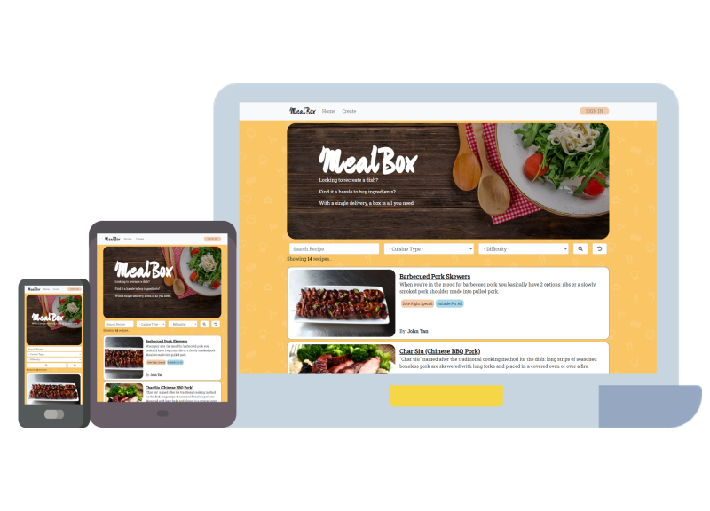
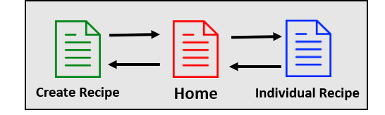
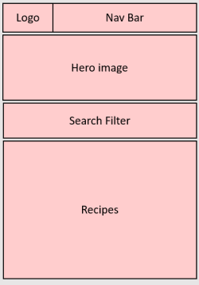
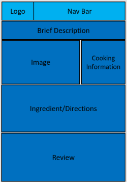
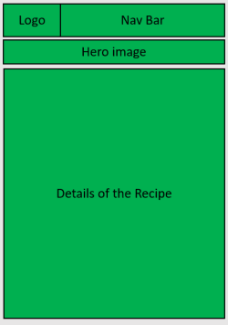
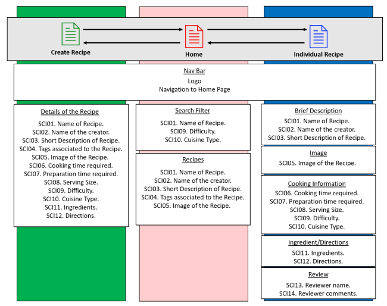

# Reactive Frontend Frameworks and RESTful API Development

# **MealBox**
## Context
This project aims to create an interactive web application using React and creating my own RESTful API using Mongo and Express. 

This application serve the following purpose:
* Allow users to search, read and comment on cooking recipes.
* Create and share personal recipe on the website. 
* Purchase all the required ingredients for the recipe. 

User's Goal: To create, search, read and comment on the recipes. To buy necessary required ingredients for the recipe. 

Site owner's goal: To showcase proficiency in the mentioned programming language.


## Access
Url to live site: 




# Defining the Project
The purpose of this website is to build a community and allow users to share and follow cooking recipes. 

Many times when we see cooking tutorial online we get intrigued and want to try out the recipe ourselves. 

Mealbox will allow users who wants to recreate the said recipe an option to get all the ingredients delivered in a box. 

There is no need for the user to head down to their local supermarket and search for all the ingredients. 

# Strategy
## Identifying External Users
With the primary purpose mentioned above, the website's primary users are cooking enthusiast. 

Primary users can be further split into two. 

1. Users who are here to read and comment on recipe.
2. Home cooks who are enthusiastic and wish to share their recipe to the community. 

## Identifying External Users' Goals
The users' goal here is to get the neccessary information related to the recipe. 

Therefore, the interface should be simple to understand and easy to interact with.  

```
EUG01. See all recipes.
EUG02. Find out if a recipe exist in the database.
EUG03. See key information of the selected recipes, such as ingredients, directions and cooking time. 
EUG04. Post comments/reviews on the platform. 
EUG05. Create recipe. 
```

## Identifying Users Pain Point
Typical recipe website will only show you the steps and ingredients needed. Users will be required to head down to their nearest mart and find the ingredients required. Often than not, amateur may find it hard to identify the correct ingredient required. 

``` 
UPP01. Finds it hard to locate each individual ingredient. 
``` 

## Identifying Site Owner's Goals
As a start of my journey to become a software developer. My goal as the site owner is to showcase my proficiency in MERN(MongoDB,Express,React,Node).

```
SOG1. Showcase my proficiency in MERN(MongoDB,Express,React,Node).
SOG2. Provide a platform to solve users pain point 
```

## User stories
```
US01. As a user, I want to look at all the recipes, so that I know what are avaiable.
US02. As a user, I want to search for a recipe, so that I know if it exist in the database
US03. As a user, I want to see the details of the recipe, so that I can follow the steps to recreate the dist.
US04. As a user, I want to know buy all the ingredients at a go, so that I can recreate it on my own. 
US05. As a user, I want to comment on a recipe, so that I can share my experience with others. 
```

# Scope
## Functional Requirement
```
FR01. Database to hold all the information.
FR02. User can search base on certain key parameters to check if the recipe exist. 
FR03. User should be able a create recipe.
FR04. Mobile responsive to decides such as Phone, Tablet and Laptop.
FR05. Navigational bar to toggle between pages. 
``` 

## Non-Functional Requirement
```
NFR01. Ensure readability.
NFR02. For security purpose, users private details should not be stored.
```

## Content Requirement
### Mandatory Requirement
The list below contains the mandatory requirement for the site to meet all of the users goals (EUG01-05).

```
CRM01. Simple layout for overview of all recipe. (EUG01)
CRM02. Search Filter. (EUG02)
CRM03. Information Table. (Static Data, such as Ingredients, Directions, Cooking Time, Serving Size) (EUG03)
CRM04. Comment Section on the individual recipe. (Reviewer Name and Comments.) (EUG04)
CRM05. Tab to create reciepe which will then be stored in DB. (EUG05)
```

### Optional Requirement
The list below are optional requirements that can be implemented to enhance the site's feature. 

They may not be implemented due to various reasons. (Eg, authorisation, access to system/domains)

```
CRO01. Store individual account/user's preference.
CRO02. Purchase ingredients from their nearby supermarkets. 
CRO03. Make payment. 
``` 

# Structure
## Content Information
Information that are required to fulfil the mandatory content requirement.

Some information will be shared across different pages.

### Information required on the overview of all recipe. 
```
SCI01. Name of Recipe.
SCI02. Name of the creator.
SCI03. Short Description of Recipe.
SCI04. Tags associated to the Recipe.
SCI05. Image of the Recipe. 
```

### Information required on the individual recipe. 
```
SCI06. Cooking time required.
SCI07. Preparation time required.
SCI08. Serving Size.
SCI09. Difficulty.
SCI10. Cuisine Type.
SCI11. Ingredients.
SCI12. Directions.
SCI13. Reviewer name.
SCI14. Reviewer comments.
```

### Information required on the create recipe page
Information required is the same as individual recipe page. 


## Content Structure
The content structure of this page will follow a **LINEAR STRUCTURE**.

Home Page > Individual Recipe Page
Home Page > Create Recipe Page



1. Home Page:
    * The page will only have a few section that contains the hero image, search filter and showing of the recipes.  
    * When there is no search, database will show all recipes. 
    * Search filter contain the following. 
        1) Search by recipe name. (Case insensitive)
        2) By cuisine type. 
        3) By difficulty. 
    * The page should allow the users to select an recipe and read up on it's detail. 

2. Individual Recipe Page: 
    * The page will present all data associated with the recipe.  
    * Comment section to allow user to share reviews with others. 

3. Create Recipe Page: 
    * The page will require user to insert all data associated with the recipe. 
    * Image should be stored as a URL.  


# Skeleton
## Interface Design
All page should adopt a similar design for harmony in design. 

## Home Page
This page will focus search and display of the recipe. 



## Individual Recipe Page
This page will focus on showing all the relevant information of the recipe. 



## Create Recipe Page
This page will gather input relevant information of the recipe from the user. 



## Site Map



## Navigation
Navigation between sites can be done by using the nav bar provided. 
